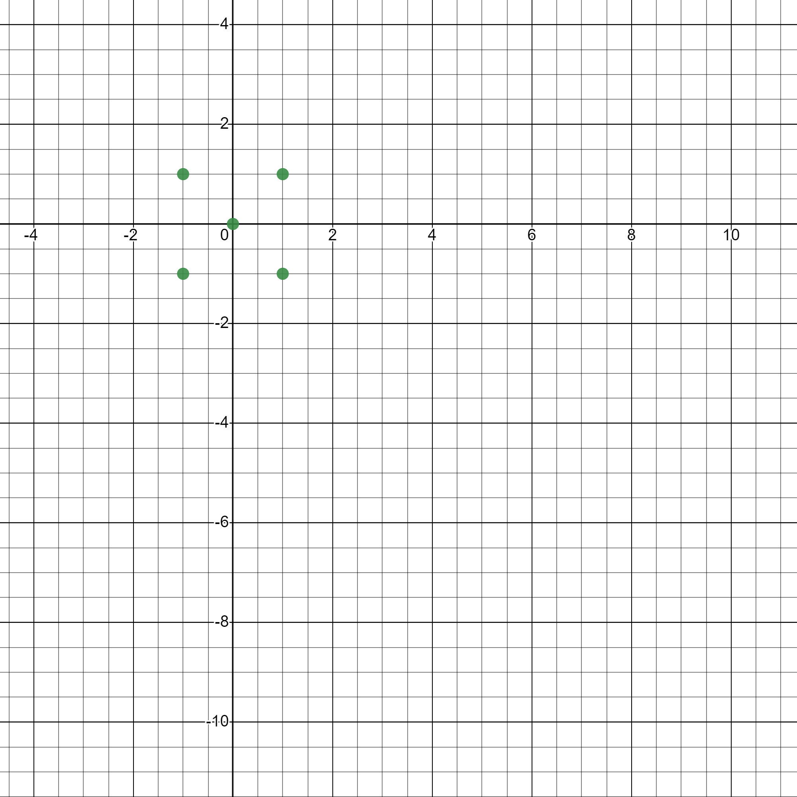

# CMPS-4883-101 <br>Topics in Computer Science: Programming Techniques <br> UVa Online Judge Problem #10135: Herding the Frosh
## By: Angel Badillo ([@It-Is-Legend27](https://github.com/It-Is-Legend27/))<br>Date: 11/01/22
<br/>

### Problem summary:
##### [[Full problem statement here](https://onlinejudge.org/external/101/10135.pdf)]
You are given a set of Cartesian points that each represent the location of a "Frosh" (a college freshman) relative to the telephone post in meters. The telephone has the coordinate point of the origin (0,0). The goal is for all the "Frosh" to be round up with "the minimum amount of silk necessary to encircle all the Frosh". <sup>1</sup> The restriction is that there will be no more than 1000 Frosh.

### The Goal:
Essentially, the goal is to find the minimum length of silk need to surround all the "Frosh". The silk will be tied to a telephone pole, will enclose all the "Frosh" in a manner that the minimum length of silk will be used, and will finally return back to the telephone to be tied.

### Explanation
Given the information in the problem statement, it is clear that the goal of the problem is to construct some sort of polygon, given the coordinates of the Frosh, where the polygon has the smallest perimeter possible. It can be ruled out that a non-convex polygon, or concave polygon would not be of good use in this situation, as it would not provide that shortest possible perimeter. Furthermore, even the smallest possible circle that will encompass all the freshman would be of no use, as it would still require constructing a polygon, a cylic polgyon to be exact, and such a polygon would still have a perimeter smaller than the circle.<sup>5</sup>

### Non-convex Polygon Example
##### Image source: https://en.wikipedia.org/wiki/Convex_hull#/media/File:Convex_hull_of_a_simple_polygon.svg
>  <br>
> <br> In the image above, the combination of the blue and yellow portions represent the convex hull, and the blue portion alone represents a simple polygon.<sup>6</sup> From mere observation, it can be concluded that the simple polygon would have a much greater perimeter than the convex hull, thus finding the perimeter of a non-convex polygon is not of use for solving the "Herding the Frosh" problem.

### Circle Example
##### Image source: https://useruploads.socratic.org/wwCKF99KTWGvJwQllTV9_equilateralTriangle.gif
> <br>
> <br> In the figure above, the inscribed equilateral has a side length of 
approximately 58.25, thus the perimeter of the triangle is 174.75.<sup>4</sup> The circumference of the circle is 2πr, where the radius r is 36. The circumference of the circle above is approximately 226.19, therefore my previously stated conjectured regarding the circumscribing circle not having the smallest length of silk holds true. For other polygons, it holds, since every polgyon inscribed in a circle is convex, but I shall spare the proof as it is a bit tedious to prove such a statement.

### How To Solve:
The solution here is to take the set of points in the test case to come up with a convex hull. Then, from there we will find the shortest length from the origin to a vertex of the convex hull. Once that is done, we will compute the length of silk,  _`l`_, using the perimeter of the polygon create by the convex hull, _`P`_, and the shortest length from the origin to a vertex, _`s`_. The formula for the shortest length of silk used will be:
```
l = P + 2s
```

### Working it out by hand:
>  <br>
> <br>
> This image represents the sample input provided in the [problem statement](https://onlinejudge.org/external/101/10135.pdf), which consisted of the points `(1.0, 1.0), (-1.0 ,1.0), (-1.0, -1.0)`, and `(1.0, -1.0)`. Given that this is a square, it is quite simple to calculate the perimeter, as well as the shortest length from the origin to a vertex. All sides of a square are congruent, and the diagonals are congruent as well. From there, we just used the distance formula to calculate the side length, as well as to find the length from the origin to the vertex. The side length is 2, and the length from the origin to the vertex is √2. Using the previously mentioned formula for finding the shortest length of silk to be used, we get _l_ = 8 + 2√2 = 10.83 (rounded to 2 decimal places), which is exactly what the sample output is.

### Simple Psuedocode for the Solution
```python
# Coordinates of telephone pole, O
origin = (0,0)

# no. of test cases
T = input()

# Find the shortest length of silk for each case
for c = 0 : 1 : T-1
    
    # get no. of Frosh
    N = input()
    
    # Create viable data structure, array, to hold N no. frosh coords
    F[N]
    
    # Read in all frosh coords
    for i = 0 : 1 : N-1
        F[i] = input()
    end-for
    
    # Find the set of points that form the convex hull, C, for given set of coords, F
    # Refer to https://www.geeksforgeeks.org/convex-hull-set-2-graham-scan/ for more info
    C[] = GrahamScan(F)
    
    # Compute the perimeter, P of convex hull
    P = 0
    
    # Save set of shortest distances to O, D for later use
    D[C.size]

    # Calculate each distance from each vertex to O, then put into D.
    # Then, calculate each edge length of the convex hull and add to P.
    # NOTE: It is assumed that the points are ordered in such a manner that
    # you would be looping over them in a clock-wise / counterclock-wise manner,
    # so each edge would be computed correctly.
    for i = 0:1:C.size-1
        D[i] = distance(C[i], origin)
        P += distance(C[i+1 % C.size], C[i])
    end-for
    
    # Set first side length as shortest length to begin
    S = D[0]
    
    # Iterate through all side lengths, set S to D[i] if shorter side found
    for i = 1:1:D.size-1
        if D[i] < S
            S = D[i]
        end-if
    end-for
    
    # Calculate total length
    l = P + 2*s
    
    # Display the perimeter
    print(l)
end-for
```

### How to Find the Convex Hull
There are many algorithms out there to find the set of points that form a convex hull, but the two algorithms I tried out. The first I tried out was the Quickhull algorithm, which is a divide and conquer algorithm, just like the Quicksort algorithm.<sup>3</sup> The average time complexity of this algorithm is O(NlogN), but the worst case is O(n<sup>2</sup>). The way the algorithm works, is that it divides the 3rd step into two subproblems, and solves them recursively.<sup>3</sup> The 4 steps to finding the convex hull as described by the algorithm is as follows:
> 1. Find the point with minimum x-coordinate lets say, min_x and similarly the point with maximum x-coordinate, max_x.
> 2. Make a line joining these two points, say L. This line will divide the whole set into two parts. Take both the parts one by one and proceed further.
> 3. For a part, find the point P with maximum distance from the line L. P forms a triangle with the points min_x, max_x. It is clear that the points residing inside this triangle can never be the part of convex hull.
> 4. The above step divides the problem into two sub-problems (solved recursively). Now the line joining the points P and min_x and the line joining the points P and max_x are new lines and the points residing outside the triangle is the set of points. Repeat point no. 3 till there no point left with the line. Add the end points of this point to the convex hull.<sup>3</sup>
#### Intially, I decided to use this algorithm to find the convex hull, but my biggest concern was that it was recursive. The reason this could pose an issue is that there can be at most 1000 Frosh, and I simply did not want to risk not meeting the time requirements.
The second algorithm I tried out, and that I stuck to and even mentioned in the psuedocode, was the Graham Scan algorithm. I chose the Graham scan algorithm because it also has an average time complexity of O(NlogN) (if you sort the points with a O(NlogN) sorting algorithm). Technically, it still does involve a bit of recursion since the implementation I used from GeeksForGeeks utilized the qsort function from the C++ STL.<sup>2</sup> Nonetheless, the qsort function should still be a bit more optimimal, since it's a part of the C++ STL, or at least that is my assumption. In addition, I was had the notion that the Graham Scan algorithm would result in a sequence of points ordered in such a way that I could easily calculate the perimeter, however, that was not the case, or at least, the implementation on GeeksForGeeks did not accomplish that. I came to such an assumption because of this image from the GeeksForGeeks article regarding the Graham Scan algorithm: <br>
##### Image source https://media.geeksforgeeks.org/wp-content/uploads/GrahamScan1.png 


### Issues Encountered:
The biggest issue I had with solving this problem was correctly calculating the perimeter of the convex hull. I tried all the aforementioend algorithms for finding the convex hull, hoping that one of them would sort the points in a manner to make it easier for me to calculate the perimeter, but that did not work out. Furthermore, I also tried out the Jarvis March algorithm, however, I quickly stopped using it as the average time complexity is O(nh), and it also did not have the points sorted in a nice manner. I myself did try to sort the points, but it was to no success, as it was very tedious to come up with an algorithm to properly accomplish such a task. Just by looking at the graph of the convex hull, one could easily sort the points as previously mentioned, but it was far from straightforward to come up with the code to accomplish that. I would like to mentioned that I originally started solving this problem in Python 3, but I quickly moved away from that approach because I was worried that my solution would not meet the time restraint, so I shortly went to solving the problem in C++.


<br>

## References:
1. [10135 Herding Frosh](https://onlinejudge.org/external/101/10135.pdf). https://onlinejudge.org/external/101/10135.pdf
2. GeeksforGeeks. [Convex Hull | Set 2 (Graham Scan)](https://www.geeksforgeeks.org/convex-hull-set-2-graham-scan/). GeeksforGeeks. Published July 24, 2013. https://www.geeksforgeeks.org/convex-hull-set-2-graham-scan/
3. GeeksforGeeks. [Quickhull Algorithm for Convex Hull](https://www.geeksforgeeks.org/quickhull-algorithm-convex-hull/). GeeksforGeeks. Published April 19, 2017. https://www.geeksforgeeks.org/quickhull-algorithm-convex-hull/
4. Socratic. [How Do You Find Length of Sides of an Equilateral Triangle Inscribed in a Circle with a Radius of 36?](https://socratic.org/questions/how-do-you-find-length-of-sides-of-an-equilateral-triangle-inscribed-in-a-circle). Socratic.org. Published 2015. https://socratic.org/questions/how-do-you-find-length-of-sides-of-an-equilateral-triangle-inscribed-in-a-circle
5. Michigan State University. [Cyclic Polygon](https://archive.lib.msu.edu/crcmath/math/math/c/c885.htm). Michigan State University. https://archive.lib.msu.edu/crcmath/math/math/c/c885.htm
6. Eppstein D. [Convex Hull ( in Blue and Yellow) of a Simple Polygon (in Blue)](https://en.wikipedia.org/wiki/Convex_hull#/media/File:Convex_hull_of_a_simple_polygon.svg).; 2019. https://en.wikipedia.org/wiki/Convex_hull#/media/File:Convex_hull_of_a_simple_polygon.svg